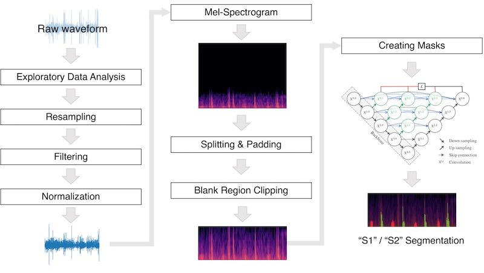

# Heart Signal Project
이 저장소는 심장 검진 보조를 위한 심음 세그멘테이션 딥러닝 모델 프로젝트 'Heart Signal'에서 사용한 코드와 자료를 포함하고 있습니다.


## Data
데이터셋은 [PhysioNet Challenge](https://physionet.org/news/post/challenge-2024)에서 제시하는 [The CirCor DigiScope Phonocardiogram Dataset](https://physionet.org/content/circor-heart-sound/1.0.3/)을 사용합니다.

```bash
wget -r -N -c -np https://physionet.org/files/circor-heart-sound/1.0.3/
```

## Prerequisites
- [Librosa](https://librosa.org/doc/latest/index.html): 오디오 데이터 전처리
- [tourchaudio](https://pytorch.org/audio/stable/index.html): 오디오 데이터 필터링
- [OpenCV](https://opencv.org/): 이미지 데이터 처리
- [keras](https://keras.io/): 딥러닝 모델링 및 학습/추론

대표적인 라이브러리가 아래에 나와있으며 자세한 버전은 `requirements.txt`를 참고하세요.
아래 명령어를 통해 한번에 설치가 가능합니다.

```bash
pip install -r requirements.txt
```


## Usage
### Training
### Inference